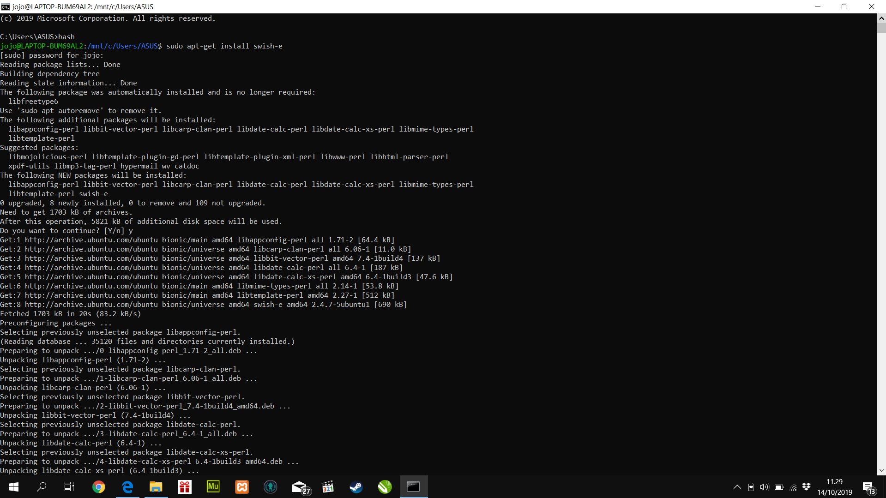
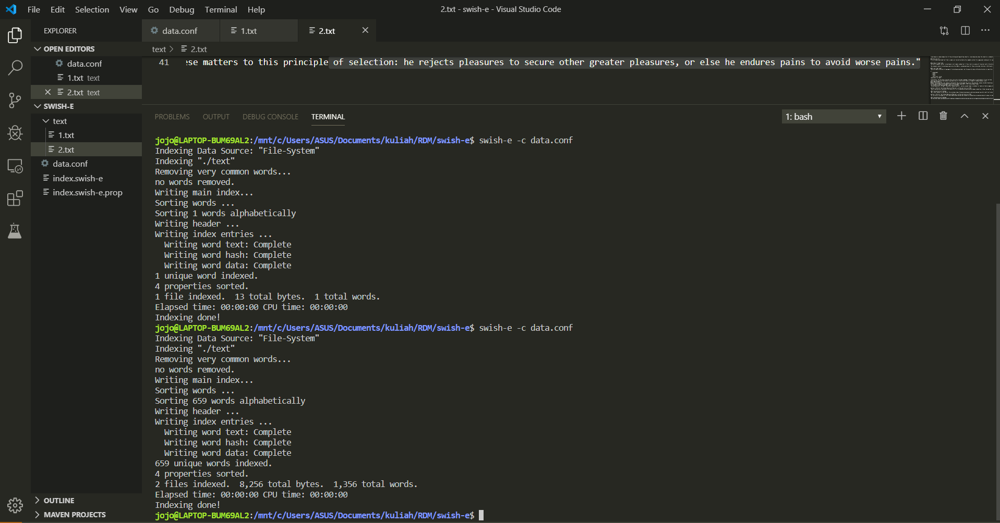
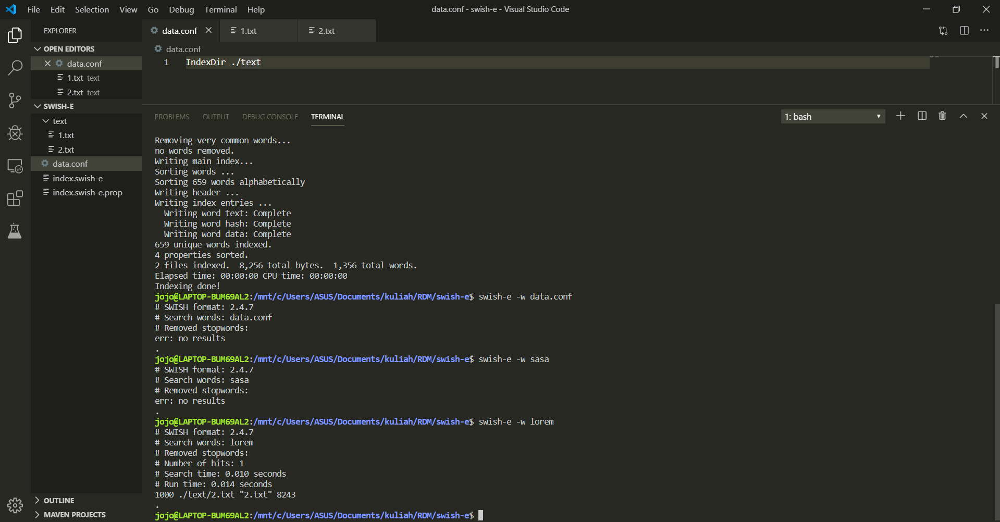
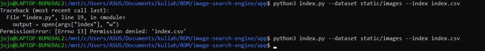

# TugasRDM

## Text-indexing
### Step 1 :

1. $ ```sudo apt-get install swish-e```



### Step 2 Run Program :

1. ```swish-e -c main.conf```


1. ```swish-e -w main.conf```


## Image-indexing
 
1. ```pip install -r requirements.txt```


2. ```cd ./app```

3. ```python3 index.py --dataset static/images --index index.csv```


4. Hasil index


